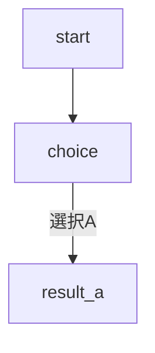

# API Documentation

TyranoStudio MCP Server の完全なAPI仕様書です。

## 目次

- [基本操作](#基本操作)
- [シナリオ操作](#シナリオ操作)
- [リソース管理](#リソース管理)
- [検証・分析](#検証分析)
- [開発支援](#開発支援)
- [エラーハンドリング](#エラーハンドリング)

---

## 基本操作

### list_projects

プロジェクト一覧を取得します。

**パラメータ**: なし

**戻り値**:
```
プロジェクト一覧:
- project1
- project2
```

**例**:
```json
{}
```

---

### create_project

新規プロジェクトを作成します。

**パラメータ**:
| 名前 | 型 | 必須 | デフォルト | 説明 |
|------|-----|------|-----------|------|
| project_name | string | ✅ | - | プロジェクト名 |
| template | string | ❌ | tyranoscript_ja | テンプレート種類 |

**テンプレート**:
- `tyranoscript_ja`: 日本語テンプレート
- `tyranoscript_en`: 英語テンプレート

**戻り値**:
```
プロジェクト '{project_name}' を作成しました
```

**例**:
```json
{
  "project_name": "my_game",
  "template": "tyranoscript_ja"
}
```

**エラー**:
- プロジェクトが既に存在する場合

---

### delete_project

プロジェクトを削除します。

**パラメータ**:
| 名前 | 型 | 必須 | 説明 |
|------|-----|------|------|
| project_name | string | ✅ | プロジェクト名 |

**戻り値**:
```
プロジェクト '{project_name}' を削除しました
```

**警告**: この操作は元に戻せません。

---

### list_project_files

プロジェクト内のファイル・ディレクトリ一覧を取得します。

**パラメータ**:
| 名前 | 型 | 必須 | デフォルト | 説明 |
|------|-----|------|-----------|------|
| project_name | string | ✅ | - | プロジェクト名 |
| path | string | ❌ | "" | 相対パス |

**戻り値**:
```
[DIR]  scenario
[DIR]  bgimage
[FILE] index.html (5432 bytes)
```

---

## シナリオ操作

### read_scenario

シナリオファイルを読み込みます。

**パラメータ**:
| 名前 | 型 | 必須 | 説明 |
|------|-----|------|------|
| project_name | string | ✅ | プロジェクト名 |
| scenario_file | string | ✅ | シナリオファイル名 (.ks) |

**戻り値**: シナリオファイルの内容（テキスト）

**例**:
```json
{
  "project_name": "my_game",
  "scenario_file": "scene1.ks"
}
```

---

### write_scenario

シナリオファイルを書き込みます。

**パラメータ**:
| 名前 | 型 | 必須 | 説明 |
|------|-----|------|------|
| project_name | string | ✅ | プロジェクト名 |
| scenario_file | string | ✅ | シナリオファイル名 |
| content | string | ✅ | シナリオ内容 |

**戻り値**:
```
シナリオファイル '{scenario_file}' を保存しました
```

**注意**: 既存ファイルは上書きされます。

---

### validate_scenario

シナリオの構文を検証します。

**パラメータ**:
| 名前 | 型 | 必須 | 説明 |
|------|-----|------|------|
| project_name | string | ✅ | プロジェクト名 |
| scenario_file | string | ✅ | シナリオファイル名 |

**検証項目**:
- ✅ タグの対応（if/endif, iscript/endscript, link/endlink）
- ✅ ラベル存在確認
- ✅ リソースファイル存在確認
- ✅ キャラクター定義確認

**戻り値**:
```
🔍 構文チェック結果:

【エラー】
行 10: [if]が閉じられていません

【警告】
行 20: 画像ファイル 'bg.jpg' が bgimage/ に見つかりません

【統計】
ラベル数: 5
ジャンプ/リンク数: 3
```

---

### generate_scenario_template

テンプレートからシナリオを生成します。

**パラメータ**:
| 名前 | 型 | 必須 | 説明 |
|------|-----|------|------|
| project_name | string | ✅ | プロジェクト名 |
| scenario_file | string | ✅ | 生成ファイル名 |
| template_type | string | ✅ | テンプレートタイプ |
| params | object | ❌ | パラメータ |

**テンプレートタイプ**:

#### 1. basic_scene
基本的なシーン

**パラメータ**:
```json
{
  "label": "start",
  "bg": "room.jpg",
  "text": "テキスト",
  "next_label": "*next"
}
```

#### 2. character_intro
キャラクター登場シーン

**パラメータ**:
```json
{
  "label": "intro",
  "chara_name": "hero",
  "chara_jname": "主人公",
  "chara_image": "hero.png",
  "dialogue": "こんにちは！"
}
```

#### 3. choice_branch
選択肢分岐

**パラメータ**:
```json
{
  "label": "choice",
  "prompt_text": "どうする？",
  "choice1_text": "選択肢1",
  "choice1_label": "branch1",
  "choice2_text": "選択肢2",
  "choice2_label": "branch2"
}
```

#### 4. dialogue
会話シーン

**パラメータ**:
```json
{
  "label": "talk",
  "chara1_name": "太郎",
  "chara2_name": "花子",
  "line1": "セリフ1",
  "line2": "セリフ2"
}
```

#### 5. title_screen
タイトル画面

**パラメータ**:
```json
{
  "label": "title",
  "bg": "title.jpg",
  "start_label": "game_start"
}
```

---

## リソース管理

### add_image

画像ファイルを追加します。

**パラメータ**:
| 名前 | 型 | 必須 | 説明 |
|------|-----|------|------|
| project_name | string | ✅ | プロジェクト名 |
| source_path | string | ✅ | コピー元パス |
| dest_category | string | ✅ | 配置先カテゴリ |
| dest_filename | string | ❌ | ファイル名 |

**カテゴリ**:
- `bgimage`: 背景画像
- `fgimage`: 前景画像（キャラクター）
- `image`: その他画像
- `system`: システム画像

---

### add_audio

音声ファイルを追加します。

**パラメータ**:
| 名前 | 型 | 必須 | 説明 |
|------|-----|------|------|
| project_name | string | ✅ | プロジェクト名 |
| source_path | string | ✅ | コピー元パス |
| audio_type | string | ✅ | 音声タイプ |
| dest_filename | string | ❌ | ファイル名 |

**音声タイプ**:
- `bgm`: BGM
- `sound`: 効果音

**対応フォーマット**: .ogg, .mp3, .m4a

---

### list_audio

音声ファイル一覧を取得します。

**パラメータ**:
| 名前 | 型 | 必須 | デフォルト | 説明 |
|------|-----|------|-----------|------|
| project_name | string | ✅ | - | プロジェクト名 |
| audio_type | string | ❌ | all | 音声タイプ |

**戻り値**:
```
【BGM】(3件)
  - theme.ogg
  - battle.ogg
【効果音】(2件)
  - click.ogg
  - jump.ogg
```

---

## 検証・分析

### analyze_project

プロジェクト全体を分析します。

**パラメータ**:
| 名前 | 型 | 必須 | 説明 |
|------|-----|------|------|
| project_name | string | ✅ | プロジェクト名 |

**分析内容**:
- シナリオ統計（ファイル数、行数、文字数）
- 推定プレイ時間（600文字/分で計算）
- リソース統計（画像、音声、動画）
- 登場キャラクター一覧

**戻り値**:
```
📊 プロジェクト分析レポート: project_name
============================================================

【シナリオ統計】
- シナリオファイル数: 5
- 総文字数: 10,000
- 推定プレイ時間: 約 16.7 分

【リソース統計】
- 背景画像: 10件
- BGM: 3件
```

---

### analyze_scenario_flow

シナリオフローを解析します。

**パラメータ**:
| 名前 | 型 | 必須 | 説明 |
|------|-----|------|------|
| project_name | string | ✅ | プロジェクト名 |
| scenario_file | string | ✅ | シナリオファイル名 |

**分析内容**:
- ラベル間の遷移
- ジャンプ・コール・選択肢
- Mermaidフローチャート

**戻り値**:
```
🔀 シナリオフロー解析: scene.ks

*start (行 1)
  → ジャンプ: *choice

*choice (行 10)
  ◇ 選択肢:
    - [選択A] → *result_a
    - [選択B] → *result_b

【Mermaidフローチャート】

```

---

## 開発支援

### git_init

Gitリポジトリを初期化します。

**パラメータ**:
| 名前 | 型 | 必須 | 説明 |
|------|-----|------|------|
| project_name | string | ✅ | プロジェクト名 |

**実行内容**:
- `git init`
- `.gitignore`作成

---

### git_commit

変更をコミットします。

**パラメータ**:
| 名前 | 型 | 必須 | 説明 |
|------|-----|------|------|
| project_name | string | ✅ | プロジェクト名 |
| message | string | ✅ | コミットメッセージ |

**実行内容**:
- `git add .`
- `git commit -m "message"`

---

### git_status

リポジトリの状態を確認します。

**パラメータ**:
| 名前 | 型 | 必須 | 説明 |
|------|-----|------|------|
| project_name | string | ✅ | プロジェクト名 |

---

### git_log

コミット履歴を表示します。

**パラメータ**:
| 名前 | 型 | 必須 | デフォルト | 説明 |
|------|-----|------|-----------|------|
| project_name | string | ✅ | - | プロジェクト名 |
| limit | number | ❌ | 10 | 表示件数 |

---

### optimize_resources

リソース使用状況を分析し、最適化提案を行います。

**パラメータ**:
| 名前 | 型 | 必須 | 説明 |
|------|-----|------|------|
| project_name | string | ✅ | プロジェクト名 |

**分析内容**:
- 使用中リソース
- 未使用リソース（削除候補）
- 存在しない参照（エラー）
- 削減可能サイズ

**戻り値**:
```
🔧 リソース最適化分析: project_name

【bgimage】
- 使用中: 5件
- 未使用: 3件
  削除候補: old_bg1.jpg, old_bg2.jpg
  削減可能サイズ: 2.5 MB

【サマリー】
- 未使用ファイル: 10件
- 削減可能: 5.2 MB

💡 最適化提案:
- 未使用ファイルを削除することでプロジェクトサイズを削減できます
```

---

### batch_rename

複数ファイルを一括リネームします。

**パラメータ**:
| 名前 | 型 | 必須 | 説明 |
|------|-----|------|------|
| project_name | string | ✅ | プロジェクト名 |
| pattern | string | ✅ | 検索パターン（正規表現） |
| replacement | string | ✅ | 置換文字列 |
| target_dir | string | ✅ | 対象ディレクトリ |

**例**:
```json
{
  "project_name": "my_game",
  "pattern": "old_",
  "replacement": "new_",
  "target_dir": "bgimage"
}
```

**結果**:
```
📝 一括リネーム結果:

【成功】
✅ old_bg1.jpg → new_bg1.jpg
✅ old_bg2.jpg → new_bg2.jpg

合計: 2件リネーム
```

---

## エラーハンドリング

### 共通エラー

**プロジェクトが見つからない**:
```
プロジェクト '{project_name}' が見つかりません
```

**ファイルが見つからない**:
```
シナリオファイル '{scenario_file}' が見つかりません
```

**Git未初期化**:
```
Gitリポジトリが初期化されていません。先にgit_initを実行してください
```

### エラーコード

すべてのエラーは例外として処理され、`TextContent`として返されます。

---

## レート制限

現在、レート制限はありません。

## バージョニング

- 現在のバージョン: 1.0.0
- APIバージョン: v1

## サポート

- GitHub Issues: https://github.com/ShunsukeHayashi/tyrano-studio-mcp/issues
- ドキュメント: https://github.com/ShunsukeHayashi/tyrano-studio-mcp