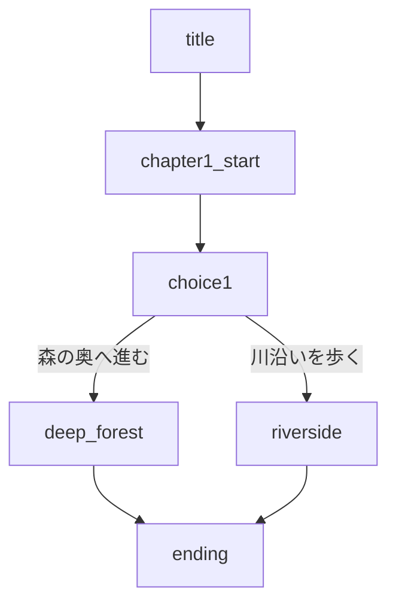

# デモプロジェクト: Simple Adventure Game

TyranoStudio MCP Serverの機能を実演するシンプルなアドベンチャーゲームです。

## 📖 概要

このデモプロジェクトは以下の機能を実演します：

- ✅ プロジェクト作成
- ✅ シナリオ作成（複数ファイル）
- ✅ キャラクター登場
- ✅ 選択肢分岐
- ✅ BGM/SE使用
- ✅ Git管理
- ✅ リソース最適化

## 🎮 ストーリー

プレイヤーは冒険者として、不思議な森を探索します。
途中で出会う仲間と共に、謎を解き明かしていく物語です。

## 📁 プロジェクト構造

```
demo_adventure/
├── data/
│   ├── scenario/
│   │   ├── first.ks          # 初期化
│   │   ├── title.ks          # タイトル画面
│   │   ├── chapter1.ks       # 第1章
│   │   ├── chapter2.ks       # 第2章
│   │   └── ending.ks         # エンディング
│   ├── fgimage/              # キャラクター画像
│   ├── bgimage/              # 背景画像
│   ├── bgm/                  # BGM
│   └── sound/                # 効果音
├── .git/                     # Gitリポジトリ
└── .gitignore
```

## 🚀 作成手順

### 1. プロジェクト作成

```python
# MCP Tool: create_project
{
  "project_name": "demo_adventure",
  "template": "tyranoscript_ja"
}
```

### 2. Git初期化

```python
# MCP Tool: git_init
{
  "project_name": "demo_adventure"
}
```

### 3. シナリオ生成

#### タイトル画面
```python
# MCP Tool: generate_scenario_template
{
  "project_name": "demo_adventure",
  "scenario_file": "title.ks",
  "template_type": "title_screen",
  "params": {
    "label": "title",
    "bg": "title_bg.jpg",
    "start_label": "chapter1_start"
  }
}
```

#### 第1章 - キャラクター登場
```python
# MCP Tool: generate_scenario_template
{
  "project_name": "demo_adventure",
  "scenario_file": "chapter1.ks",
  "template_type": "character_intro",
  "params": {
    "label": "chapter1_start",
    "chara_name": "hero",
    "chara_jname": "勇者",
    "chara_image": "hero.png",
    "bg": "forest.jpg",
    "dialogue": "ここはどこだ...？"
  }
}
```

#### 選択肢シーン
```python
# MCP Tool: generate_scenario_template
{
  "project_name": "demo_adventure",
  "scenario_file": "chapter2.ks",
  "template_type": "choice_branch",
  "params": {
    "label": "choice1",
    "prompt_text": "どの道を進みますか？",
    "choice1_text": "森の奥へ進む",
    "choice1_label": "deep_forest",
    "choice2_text": "川沿いを歩く",
    "choice2_label": "riverside"
  }
}
```

### 4. 検証

```python
# MCP Tool: validate_scenario
{
  "project_name": "demo_adventure",
  "scenario_file": "chapter1.ks"
}
```

### 5. プロジェクト分析

```python
# MCP Tool: analyze_project
{
  "project_name": "demo_adventure"
}
```

### 6. フロー解析

```python
# MCP Tool: analyze_scenario_flow
{
  "project_name": "demo_adventure",
  "scenario_file": "chapter2.ks"
}
```

### 7. Git コミット

```python
# MCP Tool: git_commit
{
  "project_name": "demo_adventure",
  "message": "Add chapter 1 and 2 scenarios"
}
```

### 8. リソース最適化

```python
# MCP Tool: optimize_resources
{
  "project_name": "demo_adventure"
}
```

## 📊 期待される結果

### プロジェクト分析結果
```
📊 プロジェクト分析レポート: demo_adventure
============================================================

【シナリオ統計】
- シナリオファイル数: 5
- 総行数: 150
- 総文字数: 3,000
- ラベル数: 8
- 選択肢数: 2
- 定義済みキャラクター数: 2

【推定プレイ時間】
- 約 5.0 分

【リソース統計】
- 背景画像: 3件
- キャラクター画像: 2件
- BGM: 2件
- 効果音: 3件
```

### フロー図


## 🎯 学習ポイント

1. **プロジェクト管理**: 作成から削除まで
2. **テンプレート活用**: 素早いシナリオ作成
3. **検証機能**: エラー検出と修正
4. **分析ツール**: プロジェクト全体の把握
5. **Git連携**: バージョン管理
6. **最適化**: リソース整理

## 🔧 カスタマイズ

このデモを元に、以下のようにカスタマイズできます：

- シーンの追加
- キャラクターの追加
- 選択肢の増加
- BGM/SEの追加
- 画像リソースの差し替え

## 📝 次のステップ

1. TyranoStudioでプロジェクトを開く
2. プレビューで動作確認
3. 追加シナリオの作成
4. ゲームの完成・公開

## 🔗 関連リンク

- [TyranoScript公式](https://tyrano.jp/)
- [TyranoStudio MCP Server](https://github.com/ShunsukeHayashi/tyrano-studio-mcp)